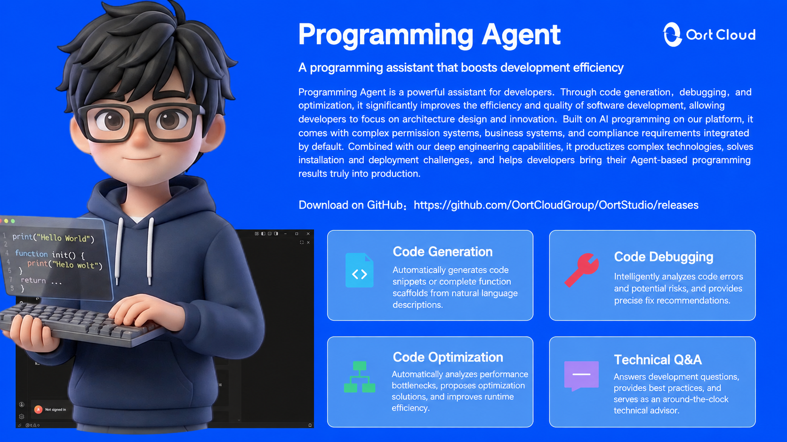

<h1 align="center">OortCodex Desktop</h1>

<p align="center"><strong>A coding agent workbench for everyone</strong></p>
<p align="center"><em>The power to turn ideas into reality belongs to everyone.</em></p>

<p align="center">
  English | <a href="README.zh-CN.md">简体中文</a>
</p>



## 📖 Overview

OortCodex Desktop is a coding agent workbench built for everyone. It hands the entire path from "describing what you want" to "having something that actually runs" — reading code, researching, editing files, running commands, executing tests, debugging — to an agent that works alongside you.

You do not have to become a programmer first. If you can explain the idea clearly, the agent helps you build it.

> **The power to turn ideas into reality belongs to everyone.**

## ✨ Why "for everyone"

- **Natural language is the interface.** Describe your goal in plain words; the agent plans the steps, does the work, and reports back.
- **One brain, three interfaces.** The desktop app, the browser workbench, and the terminal share the same Agent runtime, the same workspace, and the same account — switch anytime without losing context.
- **From an idea to a real deliverable.** It doesn't just produce code snippets — it reads docs, calls external tools, runs verification, and hands you something usable.
- **Professionals are not shortchanged.** Multiple workspaces, parallel sessions, a plugin marketplace, MCP, hooks, and remote development are all there.

## 🧩 Core Capabilities

### 🤖 The coding agent

- Understands the whole project, breaks work into steps, and plans multi-step tasks instead of answering a single question.
- Reads and writes files, runs commands, executes tests, locates and fixes problems.
- Sessions can be resumed, forked, and run in parallel, so long tasks keep their context.

### 🖥 One brain, three interfaces

| Interface      | Form                                            | Best for                                                        |
| -------------- | ----------------------------------------------- | --------------------------------------------------------------- |
| Desktop app    | Electron client, ready out of the box           | Most users; those who want a full GUI and local file access     |
| Browser workbench | Web client hosted by a local backend          | Working from any device, right in the browser                   |
| Terminal UI    | The `oortcodex` command line (TUI)              | Developers who live in the shell, plus automation and scripting |

All three share the same Agent runtime, the same workspace, and the same account — start anywhere and just keep going.

### 🔌 Plugins and extensibility

A plugin is the unit of extension in OortCodex, and one plugin can ship skills, custom commands, MCP servers, and hooks at once:

- **Official marketplace**: built-in plugins plus SHA-256 verified CDN plugins, in one catalog with one-click install and update.
- **Personal sources**: git / GitHub / URL / local directory / inline plugins — bring your own tooling.
- **Ready to use**: Browser Use, Document Skills, Skill Creator, and OortCodex Guide are enabled by default.
- **Enable on demand**: iOS Simulator, Android Emulator, legacy session migration, and more stay off until you need them.

### 🧠 MCP and hooks

- **MCP**: supports `stdio`, `http`, and `sse` servers; tools are exposed to the model as `mcp__<server>__<tool>`.
- **Hooks**: inject your own rules at key moments — session start, prompt submission, before and after tool use, permission requests, and turn completion. Hooks can add context or block a dangerous action outright.

### 🌐 Remote and collaboration

- **Remote workspaces**: connect to projects over SSH / WSL and work on remote code from the local interface.
- **Mobile remote control**: your phone connects to the workbench already running on your desktop and reuses the same session runtime — pick up where you left off.

### 💳 Models and accounts

- Sign in with a single OortCloud account, shared between the desktop app and the command line.
- Browse and switch models; usage, subscription, and credits are all in one place.

### 🛡 Security and control

- Tool calls require authorization, and dangerous actions can be blocked by rules.
- Tiered logging: high-frequency diagnostics are never written to disk in production.
- Credentials and real user data never appear in logs, examples, or commits.

## 🚀 Quick Start

### Download

Get the installer for your platform from [Releases](https://gitcode.com/OortCloudGroup/OortCodex-Desktop/releases):

- **Windows**: `.exe` installer
- **macOS**: `.dmg` disk image
- **Linux**: platform package

### Auto-update

The client reads [latest.json](latest.json) at the repository root to obtain the latest version, download URL, and SHA-256 checksum, then handles version detection and updates automatically.

### First run

1. Launch OortCodex Desktop.
2. Sign in with your OortCloud account (shared with the command line).
3. Open or create a workspace: a local directory, or a remote project over SSH / WSL.
4. Describe what you want in natural language and let the agent get to work.

## ⌨️ Command line

The command-line distribution starts with one `oortcodex` command: no arguments opens the terminal UI, and `--web` starts the browser workbench.

```bash
oortcodex                  # Start the terminal UI
oortcodex --web            # Start the browser workbench
oortcodex login oortcloud  # Sign in to OortCloud
```

## 📦 One-click CLI installation

The repository ships a cross-platform installer covering bash, PowerShell, and cmd. It first checks the
Node.js version (**24.14.0** required), then runs `npm install -g` for the `oortcodex-cli` tarball —
**version `0.0.1` by default, configurable via variables or flags**.

| Shell                 | Command                       |
| --------------------- | ----------------------------- |
| bash / zsh / Git Bash | `./scripts/install-cli.sh`    |
| PowerShell            | `.\scripts\install-cli.ps1`   |
| cmd                   | `scripts\install-cli.bat`     |

Install a specific version:

```bash
# bash / zsh / Git Bash
./scripts/install-cli.sh --version 0.0.2
OORTCODEX_CLI_VERSION=0.0.2 ./scripts/install-cli.sh   # via environment variable
```

```powershell
# PowerShell
.\scripts\install-cli.ps1 -Version 0.0.2
.\scripts\install-cli.ps1 -Version 0.0.2 -AutoInstallNode   # install Node via winget if missing
```

Configurable variables (equivalent flags take precedence):

| Variable                  | Description                                        | Default                                     |
| ------------------------- | -------------------------------------------------- | ------------------------------------------- |
| `OORTCODEX_CLI_VERSION`   | Package version to install                         | `0.0.1`                                     |
| `OORTCODEX_CLI_BASE_URL`  | Base URL of the tarball                            | `https://myoumuamua.com/mystatic/aistudio/` |
| `OORTCODEX_CLI_PKG`       | Package name                                       | `oortcodex-cli`                             |
| `OORTCODEX_NODE_VERSION`  | Required Node.js version                           | `24.14.0`                                   |
| `OORTCODEX_NODE_MODE`     | Match mode: `exact` equals / `gte` at least        | `exact`                                     |

Other useful flags: `--dry-run` (print the command only), `--allow-newer-node` (accept a newer Node
version), `--skip-url-check` (skip the download URL probe).

How it is built: `scripts/install-cli.mjs` holds the core logic (version check, URL assembly, install,
verification), while `install-cli.sh` / `install-cli.ps1` / `install-cli.bat` are the per-shell entry points.

### 🌐 Remote one-click install (no clone needed)

The scripts ship with the repository, so a single line is enough — no need to clone the repo:

```bash
# bash / zsh / Git Bash
curl -fsSL https://myoumuamua.com/mystatic/aistudio/scripts/install-cli.sh | bash

# with a specific version
curl -fsSL https://myoumuamua.com/mystatic/aistudio/scripts/install-cli.sh | bash -s -- --version 0.0.2
```

```powershell
# PowerShell
irm https://myoumuamua.com/mystatic/aistudio/scripts/install-cli.ps1 | iex

# with a specific version
$env:OORTCODEX_CLI_VERSION = '0.0.2'; irm https://myoumuamua.com/mystatic/aistudio/scripts/install-cli.ps1 | iex
```

```bat
:: cmd
powershell -NoProfile -ExecutionPolicy Bypass -Command "irm https://myoumuamua.com/mystatic/aistudio/scripts/install-cli.ps1 | iex"
```

Fallback (download first, then run — easy to retry):

```powershell
$u = 'https://myoumuamua.com/mystatic/aistudio/scripts/install-cli.ps1'
irm $u -OutFile "$env:TEMP\install-cli.ps1"
& "$env:TEMP\install-cli.ps1"
```

Emergency path (**bypasses `install-cli.ps1` entirely**, useful when the copy on the server is stale):

```powershell
$d = "$env:TEMP\oortcodex-cli-install"
New-Item -ItemType Directory -Force -Path $d | Out-Null
irm https://myoumuamua.com/mystatic/aistudio/scripts/install-cli.mjs -OutFile "$d\install-cli.mjs"
node "$d\install-cli.mjs" --version=0.0.2
```

When piped, the script fetches its core `install-cli.mjs` automatically. Sources are tried in order until
one works; set `OORTCODEX_SCRIPTS_BASE_URL` to pin your own:

| Order | Source                                                                                        |
| ----- | --------------------------------------------------------------------------------------------- |
| 1     | `$OORTCODEX_SCRIPTS_BASE_URL` (custom, highest priority)                                       |
| 2     | `https://myoumuamua.com/mystatic/aistudio/scripts/` (**primary**, same host as the tarball)     |
| 3     | `https://raw.gitcode.com/OortCloudGroup/OortCodex-Desktop/raw/main/scripts/` (fallback)         |
| 4     | `https://raw.githubusercontent.com/OortCloudGroup/OortCodex-Desktop/main/scripts/`             |
| 5     | `https://cdn.jsdelivr.net/gh/OortCloudGroup/OortCodex-Desktop@main/scripts/`                   |

> **Note:** the scripts are hosted next to the tarball at `https://myoumuamua.com/mystatic/aistudio/scripts/`,
> served over plain HTTP with no auth or User-Agent restrictions. GitCode raw stays in the chain as a
> fallback: its layout is `raw.gitcode.com/<org>/<repo>/raw/<branch>/<path>` (note the extra `/raw/` segment)
> and it rejects non-browser agents such as `curl/8.x` with `403 暂不支持预览`. The scripts always send a
> browser UA, retry each source twice, and validate downloads, skipping HTML or `暂不支持预览` responses.

> **⚠️ When uploading `install-cli.ps1`**
>
> 1. Keep it **pure ASCII and without a UTF-8 BOM**. The static host returns `application/octet-stream`,
>    which PowerShell 5.1's `irm` decodes byte by byte: with a BOM, three extra visible characters land at
>    the very start; with non-ASCII text and no BOM, `powershell -File` reads the file as GBK, multi-byte
>    sequences swallow line breaks, and comments eat the code that follows.
> 2. Do not re-save it as "UTF-8 with BOM" before uploading — ship the file exactly as it is in the repo.
>
> That is why `install-cli.ps1` uses English comments and output: **all Chinese messages are printed by the
> core script `install-cli.mjs`** (Node reads UTF-8, so nothing gets garbled). `install-cli.sh` and
> `install-cli.bat` are not affected by this constraint.
>
> **Hardened:** `install-cli.ps1` no longer uses a `param()` block and parses `$args` by hand. With a BOM,
> `param()` loses its "first statement" position and the whole script fails to parse ("The assignment
> expression is not valid"). Without `param()`, the three stray BOM characters are just treated as an
> unknown command, produce one harmless error line, and the script keeps going — so **an accidentally
> BOM-ified upload still installs successfully**.

### 🩺 Troubleshooting

**npm reports `EACCES` (common on macOS / Linux)**

Usually caused by a previous `sudo npm ...` run that left root-owned files in the cache
(`~/.npm/_cacache`). The script **detects this and automatically switches to a private cache directory**
(`~/.npm-oortcodex-cache`), so no sudo is needed. You can also pin one yourself with `--cache <dir>`
or `OORTCODEX_NPM_CACHE`.

If permissions still fail, fix the ownership as printed by the script:

```bash
sudo chown -R "$(id -u):$(id -g)" "$HOME/.npm"
sudo chown -R "$(id -u):$(id -g)" "$(npm prefix -g)"
```

Or move to a user-level global prefix (npm's own recommendation, no sudo ever again):

```bash
npm config set prefix ~/.npm-global
echo 'export PATH="$HOME/.npm-global/bin:$PATH"' >> ~/.zshrc   # use ~/.bashrc for bash
```

**zsh prints `BASH_SOURCE[0]: unbound variable`**

`install-cli.sh` now handles zsh (it falls back to `$0` when `BASH_SOURCE` is absent) — re-run with the
latest script from the repository. On Windows, use an administrator terminal to avoid `EPERM`.

## 🛠 Tech stack

Electron · React 19 · TypeScript · Node.js 24 · pnpm monorepo, across Windows / macOS / Linux.
Plugins, MCP, hooks, multi-workspace sessions, and remote connections are all built on one shared protocol.

## 🤝 Contributing

All forms of contribution are welcome:

1. Fork this repository
2. Create your feature branch (`git checkout -b feature/AmazingFeature`)
3. Commit your changes (`git commit -m 'feat: add some feature'`)
4. Push to the branch (`git push origin feature/AmazingFeature`)
5. Open a Pull Request

## 🐛 Bug Reports & Feedback

If you run into an issue or have an improvement in mind, please open an issue on GitHub / GitCode.

### Quick script to update latest.json

Run the following in PowerShell:

```powershell
# Update latest.json with the given version; default EXE path: G:\lanjian\nginx\html_88_56\OortCodex-Desktop.exe
.\scripts\update-latest.ps1 -Version "1.0.1"

# Use a custom executable path
.\scripts\update-latest.ps1 -Version "1.0.2" -ExePath "G:\lanjian\nginx\html_88_56\OortCodex-Desktop.exe"
```

## 📄 License

This project is licensed under the MIT License — see the [LICENSE](LICENSE) file for details.

## 🙏 Acknowledgements

Thanks to every developer who has contributed to OortCodex Desktop.

### Tagline

**OortCodex Desktop — the power to turn ideas into reality belongs to everyone.**
